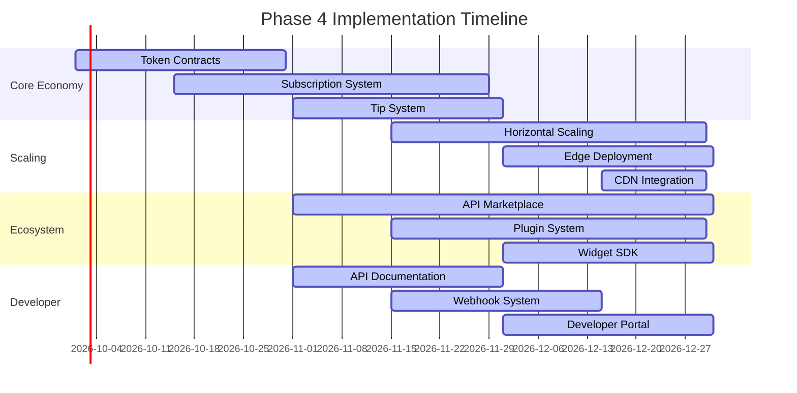

# Phase 4: Scale & Monetization - Implementation Plan

## Overview

Phase 4 transforms the P2P Music Platform from a functioning product into a sustainable, scalable business ecosystem. This phase focuses on **monetization infrastructure**, **platform scaling**, **ecosystem expansion**, and **developer relations** to establish long-term viability and growth.

**Version:** 4.0.0-scale  
**Status:** Planning  
**Duration:** Months 10-12  
**Target Release:** Q3 2026

---

## Table of Contents

1. [Monetization Infrastructure](#1-monetization-infrastructure)
2. [Platform Scaling](#2-platform-scaling)
3. [Ecosystem Expansion](#3-ecosystem-expansion)
4. [Analytics & Insights](#4-analytics--insights)
5. [Developer Platform](#5-developer-platform)
6. [Community Growth](#6-community-growth)
7. [Implementation Roadmap](#7-implementation-roadmap)
8. [Success Metrics](#8-success-metrics)

---

## 1. Monetization Infrastructure

### 1.1 Token-Based Economy

Implement a sustainable token economy to reward content creators and platform contributors.

```typescript
// src/lib/music Economy/token/Economy.ts
interface TokenEconomyConfig {
  creatorRewardRate: number;      // Tokens per stream (distributed to creator)
  seederRewardRate: number;       // Tokens per GB served
  listenerBonusRate: number;       // Tokens for consistent listening
  stakingRequirement: number;     // Minimum tokens to unlock features
  inflationRate: number;          // Annual token inflation cap
}

class TokenEconomy {
  private config: TokenEconomyConfig = {
    creatorRewardRate: 0.001,     // 0.001 tokens per stream
    seederRewardRate: 0.05,       // 0.05 tokens per GB served
    listenerBonusRate: 0.0001,    // 0.0001 tokens per minute listened
    stakingRequirement: 100,       // 100 tokens for premium features
    inflationRate: 0.05           // 5% annual inflation
  };

  async distributeCreatorRewards(
    trackId: string,
    streamCount: number,
    creatorWallet: string
  ): Promise<TransactionResult> {
    const totalReward = streamCount * this.config.creatorRewardRate;
    
    // Verify stream authenticity via blockchain verification
    const verifiedStreams = await this.verifyStreams(trackId, streamCount);
    
    const distribution: TokenDistribution = {
      creatorShare: verifiedStreams * this.config.creatorRewardRate * 0.7,
      platformFee: verifiedStreams * this.config.creatorRewardRate * 0.2,
      communityPool: verifiedStreams * this.config.creatorRewardRate * 0.1
    };

    return await this.executeDistribution(distribution, creatorWallet);
  }

  async calculateSeederRewards(peerId: string, bytesServed: number): Promise<number> {
    const qualityMultiplier = await this.getSeederQualityScore(peerId);
    return bytesServed * this.config.seederRewardRate * qualityMultiplier;
  }
}
```

### 1.2 Artist Monetization Tiers

```typescript
// src/lib/monetization/MonetizationTiers.ts
interface MonetizationTier {
  name: string;
  monthlyPrice: number;
  features: string[];
  creatorShare: number;      // Percentage of revenue to creator
  subscriberLimit: number;
}

const MONETIZATION_TIERS: MonetizationTier[] = [
  {
    name: 'Fan',
    monthlyPrice: 4.99,
    features: [
      'Ad-free listening',
      'High-quality audio (320kbps)',
      'Offline downloads',
      'Exclusive content access'
    ],
    creatorShare: 0.70,
    subscriberLimit: Infinity
  },
  {
    name: 'Super Fan',
    monthlyPrice: 9.99,
    features: [
      'All Fan features',
      'Early access to new releases',
      'Exclusive behind-the-scenes content',
      'Direct messaging with artist',
      'Virtual meetups monthly'
    ],
    creatorShare: 0.80,
    subscriberLimit: 1000
  },
  {
    name: 'Collaborator',
    monthlyPrice: 24.99,
    features: [
      'All Super Fan features',
      'Collaborate on tracks',
      'Revenue sharing options',
      'Private workspace access',
      'Analytics dashboard'
    ],
    creatorShare: 0.90,
    subscriberLimit: 100
  }
];

class ArtistMonetization {
  async createSubscription(
    artistId: string,
    tier: MonetizationTier,
    subscriberId: string
  ): Promise<Subscription> {
    const subscription: Subscription = {
      id: generateUUID(),
      artistId,
      subscriberId,
      tier: tier.name,
      monthlyPrice: tier.monthlyPrice,
      creatorShare: tier.monthlyPrice * tier.creatorShare,
      platformFee: tier.monthlyPrice * (1 - tier.creatorShare),
      status: 'active',
      startDate: new Date(),
      renewDate: addMonths(new Date(), 1)
    };

    await this.processPayment(subscription);
    await this.grantSubscriberAccess(artistId, subscriberId, tier);
    
    return subscription;
  }

  async distributeSubscriberRevenue(artistId: string, month: Date): Promise<void> {
    const subscriptions = await this.getActiveSubscriptions(artistId, month);
    
    for (const sub of subscriptions) {
      const tier = MONETIZATION_TIERS.find(t => t.name === sub.tier)!;
      const creatorAmount = sub.monthlyPrice * tier.creatorShare;
      
      await this.transferToCreator(artistId, creatorAmount, sub.id);
      await this.recordTransaction({
        type: 'subscription_revenue',
        artistId,
        subscriberId: sub.subscriberId,
        amount: creatorAmount,
        tier: sub.tier,
        month
      });
    }
  }
}
```

### 1.3 Direct Artist Support (Tips)

```typescript
// src/lib/monetization/TipSystem.ts
interface TipConfig {
  minTipAmount: number;
  maxTipAmount: number;
  platformFee: number;
  instantPayout: boolean;
  supportedCurrencies: string[];
}

class TipSystem {
  private config: TipConfig = {
    minTipAmount: 0.50,
    maxTipAmount: 500,
    platformFee: 0.05,          // 5% platform fee
    instantPayout: true,
    supportedCurrencies: ['USDC', 'ETH', 'MATIC', 'P2P']
  };

  async processTip(
    fromUserId: string,
    toArtistId: string,
    amount: number,
    currency: string,
    message?: string
  ): Promise<TipResult> {
    // Validate amount
    if (amount < this.config.minTipAmount || amount > this.config.maxTipAmount) {
      throw new Error(`Tip amount must be between ${this.config.minTipAmount} and ${this.config.maxTipAmount}`);
    }

    // Check balance
    const balance = await this.getUserBalance(fromUserId, currency);
    if (balance < amount) {
      throw new Error('Insufficient balance');
    }

    // Process tip
    const platformFee = amount * this.config.platformFee;
    const artistAmount = amount - platformFee;

    await this.debitUser(fromUserId, amount, currency);
    await this.creditArtist(toArtistId, artistAmount, currency);
    await this.recordTip({
      fromUserId,
      toArtistId,
      amount,
      currency,
      platformFee,
      message,
      timestamp: new Date()
    });

    // Send notification
    await this.notifyArtist(toArtistId, {
      type: 'tip_received',
      fromUser: await this.getUserDisplayName(fromUserId),
      amount: `${currency} ${artistAmount.toFixed(2)}`,
      message
    });

    return {
      success: true,
      tipId: generateUUID(),
      amount,
      artistReceived: artistAmount,
      platformFee
    };
  }

  async enableInstantPayout(artistId: string): Promise<void> {
    const pendingBalance = await this.getPendingPayouts(artistId);
    
    if (pendingBalance > 0) {
      await this.initiatePayout({
        artistId,
        amount: pendingBalance,
        method: await this.getArtistPreferredPayoutMethod(artistId),
        type: 'instant'
      });
    }
  }
}
```

### 1.4 Premium Features Matrix

| Feature | Free | Fan ($4.99) | Super Fan ($9.99) | Collaborator ($24.99) |
|---------|------|-------------|-------------------|----------------------|
| Ad-free listening | ❌ | ✅ | ✅ | ✅ |
| 320kbps audio | 128kbps | ✅ | ✅ | ✅ |
| Offline downloads | ❌ | ✅ (mobile) | ✅ | ✅ |
| Exclusive content | ❌ | ✅ | ✅ | ✅ |
| Early releases | ❌ | ❌ | ✅ | ✅ |
| Direct messaging | ❌ | ❌ | ✅ | ✅ |
| Virtual meetups | ❌ | ❌ | Monthly | Weekly |
| Collaborate on tracks | ❌ | ❌ | ❌ | ✅ |
| Analytics dashboard | Basic | Basic | Advanced | Full |
| Custom profile | ❌ | ❌ | ✅ | ✅ |
| Priority support | ❌ | ❌ | ❌ | ✅ |

---

## 2. Platform Scaling

### 2.1 Horizontal Scaling Architecture

```typescript
// src/lib/scaling/HorizontalScaling.ts
interface ScalingConfig {
  minInstances: number;
  maxInstances: number;
  scaleUpThreshold: number;      // CPU percentage
  scaleDownThreshold: number;    // CPU percentage
  cooldownPeriod: number;        // minutes
}

class HorizontalScaler {
  private config: ScalingConfig = {
    minInstances: 3,
    maxInstances: 20,
    scaleUpThreshold: 70,
    scaleDownThreshold: 30,
    cooldownPeriod: 5
  };

  async evaluateScaling(): Promise<ScalingAction> {
    const currentMetrics = await this.collectMetrics();
    const activePeers = await this.getActivePeerCount();
    const trackerLoad = await this.getTrackerLoad();

    // Calculate target instances based on load
    const loadFactor = (activePeers / 10000) + (trackerLoad / 1000);
    const targetInstances = Math.max(
      this.config.minInstances,
      Math.ceil(loadFactor * 3)
    );

    const currentInstances = await this.getCurrentInstanceCount();

    if (currentMetrics.cpuPercent > this.config.scaleUpThreshold && 
        currentInstances < this.config.maxInstances) {
      return { action: 'scale_up', targetInstances };
    }

    if (currentMetrics.cpuPercent < this.config.scaleDownThreshold && 
        currentInstances > this.config.minInstances) {
      return { action: 'scale_down', targetInstances };
    }

    return { action: 'maintain', targetInstances: currentInstances };
  }

  async scaleTo(targetInstances: number): Promise<void> {
    const currentInstances = await this.getCurrentInstanceCount();
    
    if (targetInstances > currentInstances) {
      await this.scaleUp(targetInstances - currentInstances);
    } else if (targetInstances < currentInstances) {
      await this.scaleDown(currentInstances - targetInstances);
    }
  }
}
```

### 2.2 Global Edge Deployment

```typescript
// src/lib/edge/EdgeDeployment.ts
interface EdgeRegion {
  code: string;
  name: string;
  location: { lat: number; lng: number };
  capacity: number;
  latency: number;
}

const EDGE_REGIONS: EdgeRegion[] = [
  { code: 'us-east', name: 'N. Virginia', location: { lat: 39.04, lng: -77.48 }, capacity: 10000, latency: 15 },
  { code: 'us-west', name: 'Oregon', location: { lat: 45.87, lng: -119.68 }, capacity: 10000, latency: 20 },
  { code: 'eu-west', name: 'Ireland', location: { lat: 53.35, lng: -6.26 }, capacity: 8000, latency: 25 },
  { code: 'eu-central', name: 'Frankfurt', location: { lat: 50.11, lng: 8.68 }, capacity: 8000, latency: 25 },
  { code: 'ap-south', name: 'Mumbai', location: { lat: 19.07, lng: 72.87 }, capacity: 5000, latency: 45 },
  { code: 'ap-northeast', name: 'Tokyo', location: { lat: 35.68, lng: 139.69 }, capacity: 6000, latency: 40 },
  { code: 'ap-southeast', name: 'Singapore', location: { lat: 1.35, lng: 103.82 }, capacity: 5000, latency: 50 },
  { code: 'sa-east', name: 'São Paulo', location: { lat: -23.55, lng: -46.63 }, capacity: 3000, latency: 55 }
];

class EdgeManager {
  async routeToNearestEdge(userLocation: { lat: number; lng: number }): Promise<EdgeRegion> {
    const sortedRegions = EDGE_REGIONS.map(region => ({
      region,
      distance: this.calculateDistance(userLocation, region.location)
    })).sort((a, b) => a.distance - b.distance);

    // Find first region with available capacity
    for (const { region } of sortedRegions) {
      const currentLoad = await this.getEdgeLoad(region.code);
      if (currentLoad < region.capacity * 0.8) {
        return region;
      }
    }

    // Fallback to closest region regardless of capacity
    return sortedRegions[0].region;
  }

  private calculateDistance(a: { lat: number; lng: number }, b: { lat: number; lng: number }): number {
    // Haversine formula for distance calculation
    const R = 6371; // Earth's radius in km
    const dLat = this.toRad(b.lat - a.lat);
    const dLon = this.toRad(b.lng - a.lng);
    const lat1 = this.toRad(a.lat);
    const lat2 = this.toRad(b.lat);

    const x = Math.sin(dLat/2) * Math.sin(dLat/2) +
              Math.sin(dLon/2) * Math.sin(dLon/2) * Math.cos(lat1) * Math.cos(lat2);
    const c = 2 * Math.atan2(Math.sqrt(x), Math.sqrt(1-x));
    return R * c;
  }

  private toRad(deg: number): number {
    return deg * (Math.PI / 180);
  }
}
```

### 2.3 Database Sharding Strategy

```typescript
// src/lib/database/ShardingStrategy.ts
interface ShardConfig {
  shardCount: number;
  shardKey: string;
  replicaCount: number;
}

class DatabaseSharding {
  private config: ShardConfig = {
    shardCount: 8,
    shardKey: 'user_id',
    replicaCount: 3
  };

  getShardId(identifier: string): number {
    // Consistent hashing for even distribution
    const hash = this.hashIdentifier(identifier);
    return hash % this.config.shardCount;
  }

  async executeQuery<T>(
    query: string,
    params: any[],
    targetShard?: number
  ): Promise<T[]> {
    const shardId = targetShard ?? this.getShardId(params[0]);
    const shard = await this.getShardConnection(shardId);
    
    return await shard.query(query, params);
  }

  async crossShardQuery<T>(
    query: string,
    params: any[]
  ): Promise<T[]> {
    const results: T[][] = [];
    
    // Execute on all shards in parallel
    const promises = Array.from({ length: this.config.shardCount }, (_, i) =>
      this.executeQuery<T>(query, params, i)
    );
    
    const shardResults = await Promise.all(promises);
    return shardResults.flat();
  }

  async rebalanceShards(): Promise<void> {
    const shardLoads = await Promise.all(
      Array.from({ length: this.config.shardCount }, (_, i) =>
        this.getShardLoad(i)
      )
    );

    const avgLoad = shardLoads.reduce((a, b) => a + b, 0) / shardLoads.length;
    const overloadedShards = shardLoads
      .map((load, index) => ({ load, index }))
      .filter(s => s.load > avgLoad * 1.5);

    for (const shard of overloadedShards) {
      await this.migrateShardData(shard.index);
    }
  }
}
```

### 2.4 CDN Integration

```typescript
// src/lib/cdn/CDNManager.ts
interface CDNConfig {
  primaryProvider: 'cloudflare' | 'fastly' | 'akamai';
  backupProviders: string[];
  cacheTTL: number;
  purgingEnabled: boolean;
}

class CDNManager {
  private config: CDNConfig = {
    primaryProvider: 'cloudflare',
    backupProviders: ['fastly'],
    cacheTTL: 86400,              // 24 hours
    purgingEnabled: true
  };

  async cacheAsset(assetId: string, content: Buffer): Promise<void> {
    const cacheKey = this.generateCacheKey(assetId);
    
    // Cache on primary provider
    await this.cdnProviders[this.config.primaryProvider].upload({
      path: cacheKey,
      content,
      ttl: this.config.cacheTTL
    });

    // Backup to secondary providers
    for (const provider of this.config.backupProviders) {
      await this.cdnProviders[provider].upload({
        path: cacheKey,
        content,
        ttl: this.config.cacheTTL
      });
    }
  }

  async purgeAsset(assetId: string): Promise<void> {
    const cacheKey = this.generateCacheKey(assetId);
    
    const purgePromises = [
      this.config.primaryProvider,
      ...this.config.backupProviders
    ].map(provider =>
      this.cdnProviders[provider].purge(cacheKey)
    );

    await Promise.all(purgePromises);
  }

  async purgeByPattern(pattern: string): Promise<void> {
    // Purge all assets matching pattern
    const affectedAssets = await this.findAssetsByPattern(pattern);
    
    for (const asset of affectedAssets) {
      await this.purgeAsset(asset.id);
    }
  }
}
```

---

## 3. Ecosystem Expansion

### 3.1 API Marketplace

```typescript
// src/lib/marketplace/APIMarketplace.ts
interface APIProduct {
  id: string;
  name: string;
  description: string;
  provider: string;
  category: 'analytics' | 'visualization' | 'promotion' | 'distribution';
  pricing: {
    free: { requests: number };
    basic: { price: number; requests: number };
    pro: { price: number; requests: number };
  };
  rating: number;
  downloads: number;
}

class APIMarketplace {
  private products: Map<string, APIProduct> = new Map();

  async listProducts(category?: string): Promise<APIProduct[]> {
    let products = Array.from(this.products.values());
    
    if (category) {
      products = products.filter(p => p.category === category);
    }
    
    return products.sort((a, b) => b.rating - a.rating);
  }

  async publishProduct(product: Omit<APIProduct, 'id' | 'rating' | 'downloads'>): Promise<APIProduct> {
    const newProduct: APIProduct = {
      ...product,
      id: generateUUID(),
      rating: 0,
      downloads: 0
    };

    this.products.set(newProduct.id, newProduct);
    
    await this.verifyProductCompliance(newProduct.id);
    await this.publishToDirectory(newProduct);
    
    return newProduct;
  }

  async rateProduct(productId: string, userId: string, rating: number): Promise<void> {
    const product = this.products.get(productId);
    if (!product) throw new Error('Product not found');

    // Update product rating
    const currentRating = product.rating;
    const ratingCount = product.downloads * 0.1; // Assume 10% of downloads are ratings
    
    product.rating = ((currentRating * ratingCount) + rating) / (ratingCount + 1);
    this.products.set(productId, product);
    
    await this.recordRating(productId, userId, rating);
  }
}
```

### 3.2 Plugin System

```typescript
// src/lib/plugins/PluginSystem.ts
interface PluginManifest {
  id: string;
  name: string;
  version: string;
  permissions: string[];
  entryPoint: string;
  scopes: ('user' | 'artist' | 'admin')[];
}

interface PluginContext {
  userId: string;
  permissions: string[];
  apiKey: string;
}

abstract class Plugin {
  abstract manifest: PluginManifest;
  abstract initialize(context: PluginContext): Promise<void>;
  abstract execute(action: string, params: any): Promise<any>;
  abstract dispose(): Promise<void>;
}

class PluginManager {
  private plugins: Map<string, Plugin> = new Map();
  private sandbox: PluginSandbox;

  async installPlugin(manifest: PluginManifest, code: string): Promise<void> {
    // Verify permissions are not excessive
    const dangerousPermissions = ['filesystem', 'network', 'eval'];
    const hasDangerous = manifest.permissions.some(p => 
      dangerousPermissions.includes(p)
    );
    
    if (hasDangerous) {
      throw new Error('Plugin requests dangerous permissions');
    }

    // Create sandboxed instance
    const pluginInstance = await this.sandbox.createPlugin(manifest, code);
    
    // Store plugin
    this.plugins.set(manifest.id, pluginInstance);
    
    // Initialize
    await pluginInstance.initialize({
      userId: manifest.id,
      permissions: manifest.permissions,
      apiKey: await this.generatePluginAPIKey(manifest.id)
    });
  }

  async executePluginAction(
    pluginId: string,
    action: string,
    params: any
  ): Promise<any> {
    const plugin = this.plugins.get(pluginId);
    if (!plugin) throw new Error('Plugin not installed');

    return await plugin.execute(action, params);
  }

  async uninstallPlugin(pluginId: string): Promise<void> {
    const plugin = this.plugins.get(pluginId);
    if (plugin) {
      await plugin.dispose();
      this.plugins.delete(pluginId);
    }
  }
}
```

### 3.3 Widget SDK

```typescript
// src/lib/sdk/WidgetSDK.ts
interface WidgetConfig {
  theme: 'light' | 'dark' | 'auto';
  size: 'small' | 'medium' | 'large';
  showArtwork: boolean;
  showTrackInfo: boolean;
  showControls: boolean;
  autoplay: boolean;
}

class MusicWidget {
  private container: HTMLElement;
  private config: WidgetConfig;

  constructor(containerId: string, config: Partial<WidgetConfig> = {}) {
    this.container = document.getElementById(containerId);
    this.config = {
      theme: 'light',
      size: 'medium',
      showArtwork: true,
      showTrackInfo: true,
      showControls: true,
      autoplay: false,
      ...config
    };
  }

  async loadTrack(trackId: string): Promise<void> {
    const trackInfo = await this.fetchTrackInfo(trackId);
    this.render(trackInfo);
  }

  async loadPlaylist(playlistId: string): Promise<void> {
    const tracks = await this.fetchPlaylistTracks(playlistId);
    this.playlist = tracks;
    this.render(tracks[0]);
  }

  render(track: TrackInfo): void {
    const widget = document.createElement('div');
    widget.className = `p2p-music-widget ${this.config.theme} ${this.config.size}`;
    
    widget.innerHTML = `
      ${this.config.showArtwork ? `` : ''}
      ${this.config.showTrackInfo ? `
        <div class="track-info">
          <h3>${track.title}</h3>
          <p>${track.artist}</p>
        </div>
      ` : ''}
      ${this.config.showControls ? `
        <div class="controls">
          <button class="play-btn">▶</button>
          <button class="pause-btn">⏸</button>
        </div>
      ` : ''}
    `;

    this.container.appendChild(widget);
  }
}
```

### 3.4 White-Label Solution

```typescript
// src/lib/whitelabel/WhiteLabelManager.ts
interface WhiteLabelConfig {
  brandName: string;
  logo: string;
  primaryColor: string;
  secondaryColor: string;
  fontFamily: string;
  customDomain: string;
  features: string[];
}

class WhiteLabelPlatform {
  async createInstance(config: WhiteLabelConfig): Promise<WhiteLabelInstance> {
    // Validate custom domain
    await this.validateDomain(config.customDomain);

    // Create instance-specific database schema
    const instanceId = generateUUID();
    await this.createInstanceSchema(instanceId);

    // Configure branding
    await this.applyBranding(instanceId, config);

    // Set up custom domain
    await this.configureDomain(instanceId, config.customDomain);

    // Enable requested features
    await this.enableFeatures(instanceId, config.features);

    return {
      id: instanceId,
      ...config,
      status: 'active',
      createdAt: new Date()
    };
  }

  async generateCSS(config: WhiteLabelConfig): Promise<string> {
    return `
      :root {
        --primary-color: ${config.primaryColor};
        --secondary-color: ${config.secondaryColor};
        --font-family: ${config.fontFamily};
      }
      
      .brand-logo {
        background-image: url('${config.logo}');
      }
      
      .btn-primary {
        background-color: ${config.primaryColor};
      }
    `;
  }
}
```

---

## 4. Analytics & Insights

### 4.1 Real-Time Analytics Dashboard

```typescript
// src/lib/analytics/AnalyticsDashboard.ts
interface AnalyticsMetrics {
  streams: {
    total: number;
    uniqueListeners: number;
    avgListenDuration: number;
    completionRate: number;
  };
  engagement: {
    likes: number;
    comments: number;
    shares: number;
    saves: number;
  };
  growth: {
    newFollowers: number;
    newSubscribers: number;
    retention: number;
  };
  revenue: {
    tips: number;
    subscriptions: number;
    total: number;
  };
}

class AnalyticsDashboard {
  async getArtistAnalytics(
    artistId: string,
    timeRange: '24h' | '7d' | '30d' | '90d' | '1y'
  ): Promise<AnalyticsMetrics> {
    const [streams, engagement, growth, revenue] = await Promise.all([
      this.getStreamMetrics(artistId, timeRange),
      this.getEngagementMetrics(artistId, timeRange),
      this.getGrowthMetrics(artistId, timeRange),
      this.getRevenueMetrics(artistId, timeRange)
    ]);

    return { streams, engagement, growth, revenue };
  }

  async getRealTimeStats(artistId: string): Promise<{
    currentListeners: number;
    recentStreams: number;
    recentTips: number;
  }> {
    const now = Date.now();
    const last5Minutes = now - 5 * 60 * 1000;

    return {
      currentListeners: await this.getCurrentListenerCount(artistId),
      recentStreams: await this.getStreamCount(artistId, last5Minutes),
      recentTips: await this.getTipTotal(artistId, last5Minutes)
    };
  }

  async getAudienceInsights(artistId: string): Promise<{
    demographics: {
      ageGroups: Record<string, number>;
      countries: Record<string, number>;
      devices: Record<string, number>;
    };
    listeningPatterns: {
      peakHours: number[];
      peakDays: number[];
      avgSessionDuration: number;
    };
  }> {
    return {
      demographics: await this.getDemographics(artistId),
      listeningPatterns: await this.getListeningPatterns(artistId)
    };
  }

  async generateInsights(artistId: string): Promise<string[]> {
    const metrics = await this.getArtistAnalytics(artistId, '30d');
    const insights: string[] = [];

    // Growth insights
    if (metrics.growth.newFollowers > metrics.growth.newFollowers * 0.2) {
      insights.push('🎉 Your follower growth has increased by 20% this month!');
    }

    // Engagement insights
    if (metrics.streams.completionRate < 0.5) {
      insights.push('💡 Consider creating shorter intro sections to improve stream completion.');
    }

    // Revenue insights
    if (metrics.revenue.tips > metrics.revenue.subscriptions) {
      insights.push('💰 Your community loves supporting you directly through tips!');
    }

    return insights;
  }
}
```

### 4.2 Music Analytics

```typescript
// src/lib/analytics/MusicAnalytics.ts
interface TrackAnalytics {
  trackId: string;
  totalStreams: number;
  uniqueListeners: number;
  totalListenTime: number;
  avgCompletionRate: number;
  peakListeners: number;
  geographicDistribution: Record<string, number>;
  referralSources: Record<string, number>;
  dropOffPoints: { timestamp: number; dropOffRate: number }[];
}

class TrackAnalytics {
  async analyzeTrack(trackId: string): Promise<TrackAnalytics> {
    const streamData = await this.getStreamData(trackId);
    
    return {
      trackId,
      totalStreams: streamData.length,
      uniqueListeners: this.countUniqueListeners(streamData),
      totalListenTime: this.calculateTotalListenTime(streamData),
      avgCompletionRate: this.calculateCompletionRate(streamData),
      peakListeners: this.findPeakListeners(streamData),
      geographicDistribution: this.aggregateGeographicData(streamData),
      referralSources: this.aggregateReferralSources(streamData),
      dropOffPoints: this.analyzeDropOffPoints(streamData)
    };
  }

  private analyzeDropOffPoints(streamData: StreamEvent[]): { timestamp: number; dropOffRate: number }[] {
    // Group streams by completion percentage
    const completionBuckets = new Map<number, number>();
    
    for (const stream of streamData) {
      const completionBucket = Math.floor(stream.completionPercent / 10) * 10;
      completionBuckets.set(completionBucket, (completionBuckets.get(completionBucket) || 0) + 1);
    }

    // Calculate drop-off rates
    const sortedBuckets = Array.from(completionBuckets.entries()).sort((a, b) => a[0] - b[0]);
    const totalStreams = streamData.length;
    
    return sortedBuckets.map(([bucket, count]) => ({
      timestamp: bucket,
      dropOffRate: 1 - (count / totalStreams)
    }));
  }
}
```

### 4.3 Competitor Benchmarking

```typescript
// src/lib/analytics/CompetitorAnalysis.ts
interface CompetitorData {
  name: string;
  monthlyListeners: number;
  engagementRate: number;
  avgStreamDuration: number;
  growthRate: number;
}

class CompetitorAnalyzer {
  private competitors: Map<string, CompetitorData> = new Map();

  async compareWithCompetitors(artistId: string): Promise<{
    artist: AnalyticsMetrics;
    percentile: number;
    comparison: CompetitorData[];
  }> {
    const artistMetrics = await this.getArtistAnalytics(artistId, '30d');
    const allArtists = await this.getAllArtistsAnalytics();
    
    // Calculate percentile
    const sortedByListeners = allArtists
      .sort((a, b) => b.streams.uniqueListeners - a.streams.uniqueListeners);
    
    const artistRank = sortedByListeners.findIndex(a => a.artistId === artistId);
    const percentile = ((allArtists.length - artistRank) / allArtists.length) * 100;

    return {
      artist: artistMetrics,
      percentile,
      comparison: this.getSimilarArtists(artistId)
    };
  }
}
```

---

## 5. Developer Platform

### 5.1 API Documentation

```typescript
// src/lib/api/APIEndpoint.ts
interface APIEndpoint {
  method: 'GET' | 'POST' | 'PUT' | 'DELETE' | 'PATCH';
  path: string;
  description: string;
  parameters: APIParameter[];
  response: APIResponse;
  examples: APIExample[];
  rateLimit: { requests: number; window: number };
  authentication: 'none' | 'user' | 'admin';
}

const API_DOCUMENTATION: APIEndpoint[] = [
  {
    method: 'GET',
    path: '/api/v1/tracks/:trackId',
    description: 'Retrieve detailed information about a specific track',
    parameters: [
      { name: 'trackId', type: 'string', required: true, description: 'Unique track identifier' }
    ],
    response: {
      200: { description: 'Track found', schema: 'TrackResponse' },
      404: { description: 'Track not found' }
    },
    examples: [
      {
        request: 'GET /api/v1/tracks/trk_abc123',
        response: {
          id: 'trk_abc123',
          title: 'Summer Vibes',
          artist: { id: 'usr_xyz', name: 'DJ Example' },
          duration: 245,
          artwork: 'https://cdn.p2p.music/img/artwork.jpg',
          magnetLink: 'magnet:?xt=urn:btih:...',
          streamCount: 15420,
          createdAt: '2026-01-15T10:30:00Z'
        }
      }
    ],
    rateLimit: { requests: 100, window: 60000 },
    authentication: 'none'
  },
  {
    method: 'POST',
    path: '/api/v1/tracks',
    description: 'Upload a new track (artist endpoint)',
    parameters: [
      { name: 'title', type: 'string', required: true, description: 'Track title' },
      { name: 'audioFile', type: 'file', required: true, description: 'Audio file (MP3, FLAC, WAV)' },
      { name: 'artwork', type: 'file', required: false, description: 'Track artwork image' },
      { name: 'genre', type: 'string', required: false, description: 'Genre tag' }
    ],
    response: {
      201: { description: 'Track uploaded successfully' },
      400: { description: 'Invalid request' },
      401: { description: 'Authentication required' }
    },
    examples: [
      {
        request: 'POST /api/v1/tracks',
        body: { title: 'My Track', genre: 'Electronic' },
        response: {
          id: 'trk_new123',
          uploadStatus: 'processing',
          estimatedProcessingTime: 120
        }
      }
    ],
    rateLimit: { requests: 10, window: 60000 },
    authentication: 'user'
  }
];
```

### 5.2 SDK Packages

```bash
# Official SDK packages
packages/
├── @p2pmusic/sdk-core/          # Core functionality (auth, API client)
├── @p2pmusic/sdk-react/          # React hooks and components
├── @p2pmusic/sdk-vue/            # Vue.js composables
├── @p2pmusic/sdk-analytics/      # Analytics integration
├── @p2pmusic/sdk-player/         # Custom player implementation
└── @p2pmusic/sdk-widget/         # Embeddable widgets
```

### 5.3 Webhook System

```typescript
// src/lib/webhooks/WebhookManager.ts
interface WebhookConfig {
  url: string;
  events: WebhookEvent[];
  secret: string;
  active: boolean;
}

type WebhookEvent = 
  | 'track.uploaded'
  | 'track.stream.started'
  | 'track.stream.completed'
  | 'follower.gained'
  | 'tip.received'
  | 'subscription.new'
  | 'comment.posted';

class WebhookManager {
  async registerWebhook(
    userId: string,
    config: Omit<WebhookConfig, 'secret'>
  ): Promise<WebhookConfig> {
    const webhook: WebhookConfig = {
      ...config,
      secret: this.generateWebhookSecret()
    };

    // Store webhook configuration
    await this.saveWebhook(userId, webhook);

    // Verify webhook URL
    const verification = await this.verifyWebhookURL(config.url);
    if (!verification.success) {
      throw new Error('Webhook URL verification failed');
    }

    return webhook;
  }

  async dispatchWebhook(
    webhookId: string,
    event: WebhookEvent,
    payload: any
  ): Promise<void> {
    const webhook = await this.getWebhook(webhookId);
    
    if (!webhook.active || !webhook.events.includes(event)) {
      return;
    }

    const signature = this.generateSignature(
      JSON.stringify(payload),
      webhook.secret
    );

    const response = await fetch(webhook.url, {
      method: 'POST',
      headers: {
        'Content-Type': 'application/json',
        'X-P2P-Webhook-Signature': signature,
        'X-P2P-Webhook-Event': event
      },
      body: JSON.stringify(payload)
    });

    if (response.status >= 400) {
      await this.handleWebhookFailure(webhookId, response.status);
    }
  }
}
```

### 5.4 Developer Portal

```typescript
// src/lib/developer/DeveloperPortal.ts
interface DeveloperApp {
  id: string;
  name: string;
  description: string;
  redirectURIs: string[];
  scopes: string[];
  createdAt: Date;
  rateLimit: number;
}

class DeveloperPortal {
  async createApplication(
    developerId: string,
    appDetails: Omit<DeveloperApp, 'id' | 'createdAt' | 'rateLimit'>
  ): Promise<DeveloperApp> {
    const app: DeveloperApp = {
      ...appDetails,
      id: generateUUID(),
      createdAt: new Date(),
      rateLimit: 1000 // Default rate limit
    };

    await this.saveApplication(developerId, app);
    
    // Generate API keys
    await this.generateAPIKeys(app.id);

    return app;
  }

  async manageScopes(appId: string, requestedScopes: string[]): Promise<string[]> {
    // Review and approve scopes
    const approvedScopes: string[] = [];
    
    for (const scope of requestedScopes) {
      const isApproved = await this.isScopeApproved(appId, scope);
      if (isApproved) {
        approvedScopes.push(scope);
      }
    }

    return approvedScopes;
  }

  async generateAPIKey(appId: string): Promise<{
    key: string;
    secret: string;
    expiresAt: Date;
  }> {
    const key = `pk_${generateRandomString(32)}`;
    const secret = `sk_${generateRandomString(64)}`;
    
    await this.saveAPIKey(appId, {
      key,
      secret: await this.hashSecret(secret),
      createdAt: new Date(),
      expiresAt: addYears(new Date(), 1)
    });

    return { key, secret, expiresAt: addYears(new Date(), 1) };
  }
}
```

---

## 6. Community Growth

### 6.1 Ambassador Program

```typescript
// src/lib/community/AmbassadorProgram.ts
interface AmbassadorProfile {
  userId: string;
  tier: 'bronze' | 'silver' | 'gold' | 'platinum';
  referrals: number;
  contentCreated: number;
  communityScore: number;
  rewards: {
    pending: number;
    claimed: number;
  };
}

class AmbassadorProgram {
  async applyForAmbassador(userId: string): Promise<{
    applicationId: string;
    status: 'pending' | 'approved' | 'rejected';
  }> {
    const application = {
      id: generateUUID(),
      userId,
      status: 'pending',
      submittedAt: new Date(),
      requirements: {
        minAccountAge: 90,
        minFollowers: 100,
        contentGuidelines: true
      }
    };

    // Check eligibility
    const user = await this.getUser(userId);
    const isEligible = 
      user.accountAge >= 90 &&
      user.followers >= 100;

    if (!isEligible) {
      return { applicationId: application.id, status: 'rejected' };
    }

    await this.saveApplication(application);
    
    return { applicationId: application.id, status: 'pending' };
  }

  async processReferralReward(
    ambassadorId: string,
    referredUserId: string
  ): Promise<void> {
    const ambassador = await this.getAmbassadorProfile(ambassadorId);
    
    // Calculate reward based on tier
    const baseReward = 50;
    const tierMultiplier = {
      bronze: 1,
      silver: 1.25,
      gold: 1.5,
      platinum: 2
    };

    const reward = baseReward * tierMultiplier[ambassador.tier];

    ambassador.rewards.pending += reward;
    ambassador.referrals += 1;

    await this.updateAmbassador(ambassador);
    
    // Tier progression check
    await this.checkTierProgression(ambassadorId);
  }

  private async checkTierProgression(ambassadorId: string): Promise<void> {
    const ambassador = await this.getAmbassadorProfile(ambassadorId);
    
    const tierThresholds = {
      bronze: 0,
      silver: 10,
      gold: 50,
      platinum: 200
    };

    const currentTierIndex = ['bronze', 'silver', 'gold', 'platinum'].indexOf(ambassador.tier);
    
    for (let i = currentTierIndex + 1; i < 4; i++) {
      const nextTier = ['bronze', 'silver', 'gold', 'platinum'][i] as AmbassadorProfile['tier'];
      if (ambassador.referrals >= tierThresholds[nextTier]) {
        ambassador.tier = nextTier;
      }
    }

    await this.updateAmbassador(ambassador);
  }
}
```

### 6.2 Creator Spotlight Program

```typescript
// src/lib/community/CreatorSpotlight.ts
interface SpotlightCandidate {
  artistId: string;
  submissionDate: Date;
  criteria: {
    uniqueStreams: number;
    engagementRate: number;
    contentQuality: number;
    communityImpact: number;
  };
  status: 'pending' | 'featured' | 'declined';
}

class CreatorSpotlight {
  async selectWeeklySpotlight(): Promise<{
    artistId: string;
    feature: {
      banner: string;
      bio: string;
      playlist: string;
    };
    startDate: Date;
    endDate: Date;
  }> {
    // Find eligible artists
    const candidates = await this.findEligibleArtists(100);
    
    // Score candidates based on criteria
    const scored = candidates.map(candidate => ({
      ...candidate,
      score: this.calculateSpotlightScore(candidate)
    }));

    // Select top candidate
    const topCandidate = scored.sort((a, b) => b.score - a.score)[0];

    return {
      artistId: topCandidate.artistId,
      feature: await this.generateFeature(topCandidate.artistId),
      startDate: getStartOfWeek(),
      endDate: getEndOfWeek()
    };
  }

  private calculateSpotlightScore(candidate: SpotlightCandidate): number {
    // Weighted scoring algorithm
    return (
      candidate.criteria.uniqueStreams * 0.3 +
      candidate.criteria.engagementRate * 100 * 0.25 +
      candidate.criteria.contentQuality * 10 * 0.25 +
      candidate.criteria.communityImpact * 10 * 0.2
    );
  }
}
```

### 6.3 Content Moderation

```typescript
// src/lib/moderation/ContentModeration.ts
interface ModerationReport {
  id: string;
  reporterId: string;
  targetType: 'track' | 'comment' | 'profile';
  targetId: string;
  reason: string;
  evidence: string[];
  status: 'pending' | 'reviewed' | 'resolved' | 'escalated';
  createdAt: Date;
}

class ContentModeration {
  async reportContent(
    reporterId: string,
    targetType: ModerationReport['targetType'],
    targetId: string,
    reason: string,
    evidence?: string[]
  ): Promise<ModerationReport> {
    const report: ModerationReport = {
      id: generateUUID(),
      reporterId,
      targetType,
      targetId,
      reason,
      evidence: evidence || [],
      status: 'pending',
      createdAt: new Date()
    };

    await this.saveReport(report);
    
    // Auto-escalate severe reports
    if (this.isSevereReason(reason)) {
      report.status = 'escalated';
      await this.notifyModerationTeam(report);
    }

    return report;
  }

  async autoModerate(reportId: string): Promise<{
    action: 'approve' | 'remove' | 'escalate';
    confidence: number;
  }> {
    const report = await this.getReport(reportId);
    const content = await this.getReportedContent(report.targetType, report.targetId);
    
    // AI-powered moderation
    const analysis = await this.moderationAI.analyze({
      content,
      reportReason: report.reason,
      context: await this.getContext(report.targetId)
    });

    if (analysis.confidence > 0.9) {
      return { action: analysis.violation ? 'remove' : 'approve', confidence: analysis.confidence };
    }

    return { action: 'escalate', confidence: analysis.confidence };
  }

  private isSevereReason(reason: string): boolean {
    const severeReasons = [
      'copyright_infringement',
      'illegal_content',
      'harmful_content',
      'exploitation'
    ];
    return severeReasons.some(r => reason.toLowerCase().includes(r));
  }
}
```

---

## 7. Implementation Roadmap

### Phase 4 Timeline

| Month | Week | Deliverable | Status |
|-------|------|-------------|--------|
| 10 | 1-2 | Token economy core contracts | ⏳ |
| 10 | 3-4 | Artist subscription tiers | ⏳ |
| 11 | 1-2 | Tip system implementation | ⏳ |
| 11 | 3-4 | Horizontal scaling infrastructure | ⏳ |
| 12 | 1-2 | Edge deployment (8 regions) | ⏳ |
| 12 | 3-4 | Developer platform launch | ⏳ |

### Dependencies



---

## 8. Success Metrics

### Phase 4 Targets

| Metric | Phase 3 (Baseline) | Phase 4 (Target) | Measurement |
|--------|-------------------|------------------|-------------|
| Monthly Revenue | $0 | $50,000 | Stripe/Payment analytics |
| Artist Earnings | $0 | $30,000 distributed | Token transactions |
| Platform Throughput | 10K concurrent | 100K concurrent | Load testing |
| Edge Locations | 2 | 8 | CDN provider dashboard |
| API Requests/Day | 100K | 10M | API analytics |
| Developer Signups | 0 | 500 | Developer portal |
| Plugin/Integration Count | 0 | 50 | Marketplace metrics |
| Ambassador Program | 0 | 100 ambassadors | Program enrollment |
| Creator Spotlight Features | 0 | 52/year | Weekly selection |

### Revenue Projection

```
Phase 4 Revenue Model (Q3 2026)

Subscription Revenue:
├── Fan Tier ($4.99/mo):    5,000 subscribers  → $24,950/mo
├── Super Fan ($9.99/mo):   1,000 subscribers  → $9,990/mo
├── Collaborator ($24.99):  100 subscribers    → $2,499/mo
└── Total Monthly:                                 $37,439/mo

Direct Support:
├── Tips Average:           $2.50              → $5,000/mo
├── Special Events:        Variable           → $2,500/mo
└── Total Monthly:                                 $7,500/mo

Platform Revenue (5% platform fee):
├── Subscription Fees:                           $1,872/mo
└── Tip Fees:                                    $375/mo
└── Total Monthly:                              $2,247/mo

Projected Monthly Revenue: $47,186
Projected Annual Revenue:  $566,232
```

---

## Summary

Phase 4 establishes the P2P Music Platform as a sustainable business with multiple revenue streams, scalable infrastructure, and an open ecosystem for developers and creators. The phase transforms the platform from a technical proof-of-concept into a commercially viable product ready for mass adoption.

**Next Steps:**
1. Secure initial funding for Phase 4 development
2. Partner with payment processors (Stripe, crypto onramps)
3. Recute founding developers for scaling infrastructure
4. Begin ambassador program beta with top creators
5. Launch developer portal beta for early adopters

---

*Document Version: 4.0.0*  
*Last Updated: February 2026*  
*Phase Lead: Platform Engineering Team*
